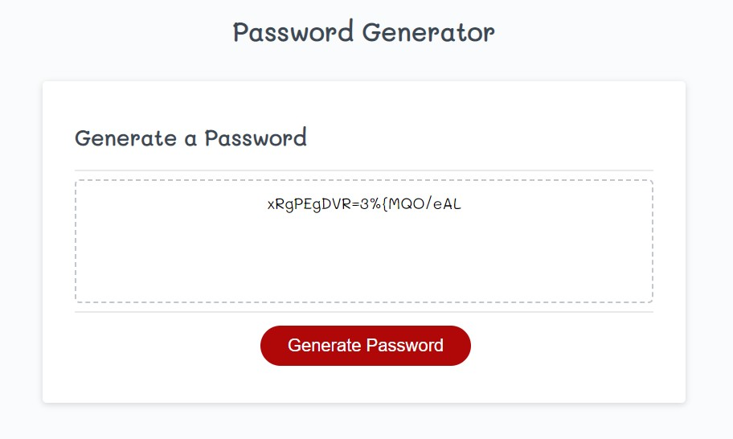

# Password Generator

## Description

This password generator asks for user input on password parameters and generates a random password that fulfills their selections. I have utilized new JavaScript concepts I have learned in the UW COding Bootcamp, such as functions, arrays, if statements, and prompts to create a working application complete with error handling. Thinking of a random and unique password can be difficult, so why not let an application do all the work for us! In creating this password generator, I have learned how to use basic JavaScript concepts to obtain user input and display interactive feedback!

## Installation

N/A. No installation necessary! Simply view my deployed page to test it out for yourself.
https://visualviolet.github.io/password-generator/

## Usage

This application can be used to generate a random password between 8 - 128 characters with your choice of character types: uppercase, lowercase, numeric, or special. Simply follow the prompts and your password will generate! Students and new developers may also find it beneficial to review the code used to create this application as many of the basic JavaScript concepts are used. The code has been commentated to explain it's functionality. Feel free to view it as you use the password generator and follow along with what's happening in the background!

## Credits

N/A

## License

MIT License
Copyright (c) 2022 VisualViolet

Please view the license in the repo for more information.
